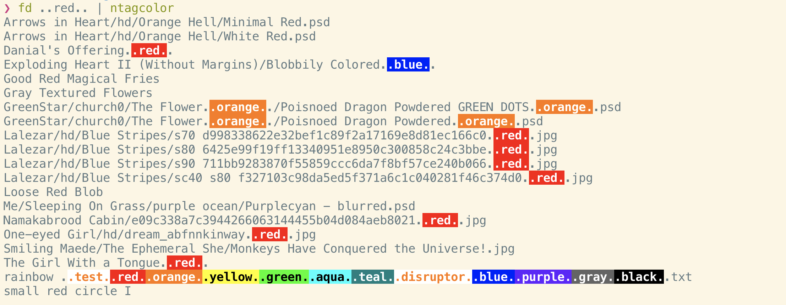

#+TITLE: ntagcolor

=ntagcolor= colorizes its input (=stdin=) according to my [[https://github.com/NightMachinary/.shells/blob/master/scripts/zsh/auto-load/others/tags.zsh][filename-based tagging system]], which is simply adding =..some tag..= to the end of the filename.
* Installation
#+BEGIN_SRC
go get -u -v github.com/NightMachinary/ntagcolor
#+END_SRC

* Usage

#+begin_src bsh.dash :results verbatim :exports code :wrap example
echo rainbow\ ..test..red..orange..yellow..green..emerald..aqua..teal..disruptor..blue..purple..gray..black..white..txt | ntagcolor
#+end_src

#+RESULTS:
#+begin_example
rainbow ..test..red..orange..yellow..green..emerald..aqua..teal..disruptor..blue..purple..gray..black..white..txt
#+end_example

* Benchmarks
#+begin_src bsh.dash :results verbatim :exports both :wrap example
z ddg # sets PWD to a big directory
hyperfine --warmup 5 "fd --color never" "fd --color never | ntagcolor" "fd --color always" "fd --color always | ntagcolor"
#+end_src

#+RESULTS:
#+begin_example
Benchmark #1: fd --color never
  Time (mean ± σ):      27.5 ms ±   5.7 ms    [User: 39.0 ms, System: 23.9 ms]
  Range (min … max):    23.0 ms …  53.1 ms    66 runs

  Warning: Statistical outliers were detected. Consider re-running this benchmark on a quiet PC without any interferences from other programs. It might help to use the '--warmup' or '--prepare' options.

Benchmark #2: fd --color never | ntagcolor
  Time (mean ± σ):      38.1 ms ±   5.7 ms    [User: 47.0 ms, System: 32.0 ms]
  Range (min … max):    32.7 ms …  55.5 ms    65 runs

Benchmark #3: fd --color always
  Time (mean ± σ):      52.2 ms ±   8.4 ms    [User: 50.3 ms, System: 37.1 ms]
  Range (min … max):    45.7 ms …  75.5 ms    51 runs

  Warning: Statistical outliers were detected. Consider re-running this benchmark on a quiet PC without any interferences from other programs. It might help to use the '--warmup' or '--prepare' options.

Benchmark #4: fd --color always | ntagcolor
  Time (mean ± σ):      67.3 ms ±   8.6 ms    [User: 63.6 ms, System: 53.2 ms]
  Range (min … max):    57.6 ms …  89.9 ms    35 runs

Summary
  'fd --color never' ran
    1.39 ± 0.35 times faster than 'fd --color never | ntagcolor'
    1.90 ± 0.50 times faster than 'fd --color always'
    2.45 ± 0.59 times faster than 'fd --color always | ntagcolor'
#+end_example

* Tests
#+begin_src bsh.dash :results verbatim :exports both :wrap example
arrN test t6. t6..wes t6.. t6..1 t6..1. t7..as.we rainbow\ ..test..red..orange..yellow..green..aqua..teal..disruptor..blue..purple..gray..black..white..txt | ntagcolor
#+end_src

#+RESULTS:
#+begin_example
test
t6.
t6..wes
t6..
t6..1
t6..1.
t7..as.we
rainbow ..test..red..orange..yellow..green..aqua..teal..disruptor..blue..purple..gray..black..white..txt
#+end_example
